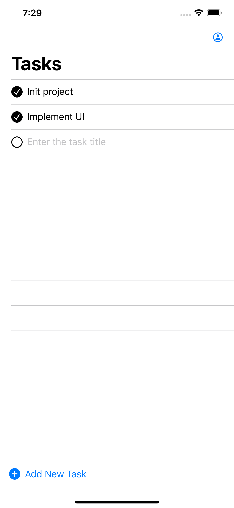

# FireStore Todo

A simple Todo app written in SwiftUI and used Firebase Firestore for storage

	
    

## Feature

[x] CRUD task
[x] Persitent storage using Firebase Firestore
[x] Sign in with Apple

## Requirements
iOS version >= 13